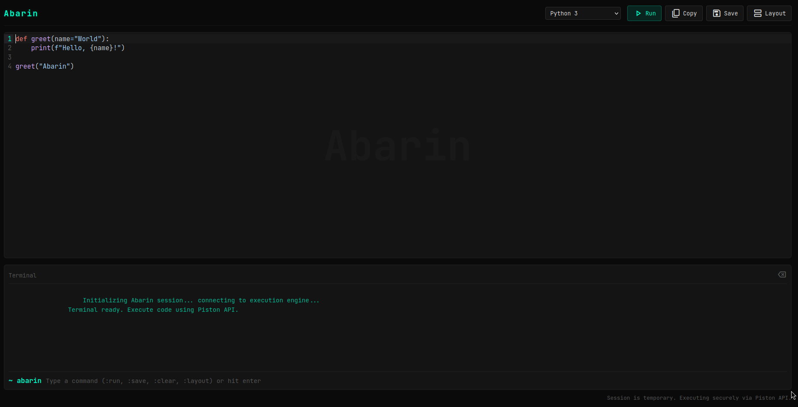

Abarin is a lightweight, clean, and fast web-based code editor. It is designed to provide a minimal, distraction-free environment for writing and running code directly in your browser.

## Features

- **Multi-Language Support**: Write and run code in Python, JavaScript, C++, Java, and Rust.
- **Live Code Execution**: Compiles and runs your code instantly in the browser without any setup.
- **Split Layouts**: Easily switch between horizontal and vertical viewing modes.
- **Syntax Highlighting**: Built-in syntax coloring tailored for reading code comfortably.
- **Local Saving**: Save your code files directly to your device with one click.
- **No API Keys Needed**: Abarin is powered entirely by the free Judge0 Community API, meaning it requires no backend setup.

## Getting Started

Abarin runs fully in the browser and needs no complicated installation. 

### Option 1: Live Demo
You can view and use Abarin directly online via the Netlify deployment link: [https://abarin.netlify.app/](https://abarin.netlify.app/)

### Option 2: Local Use
1. Download or clone this repository to your computer.
2. Double-click the `index.html` file to open it in any web browser.
3. Start coding!

## Built With

- **HTML / CSS / JavaScript**: For structure, styling, and functionality.
- **CodeMirror 6**: For the syntax-highlighted code editor environment.
- **Judge0 API**: For remote, secure code execution.

## License
Feel free to use, modify, and distribute this project as you see fit.
